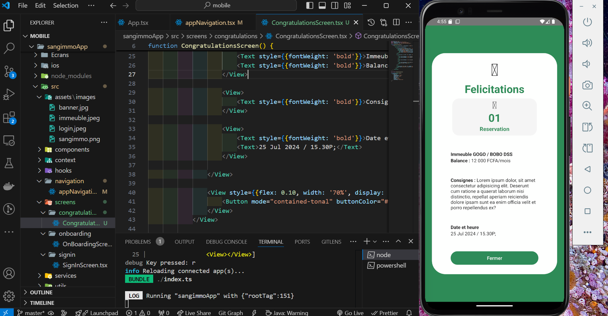
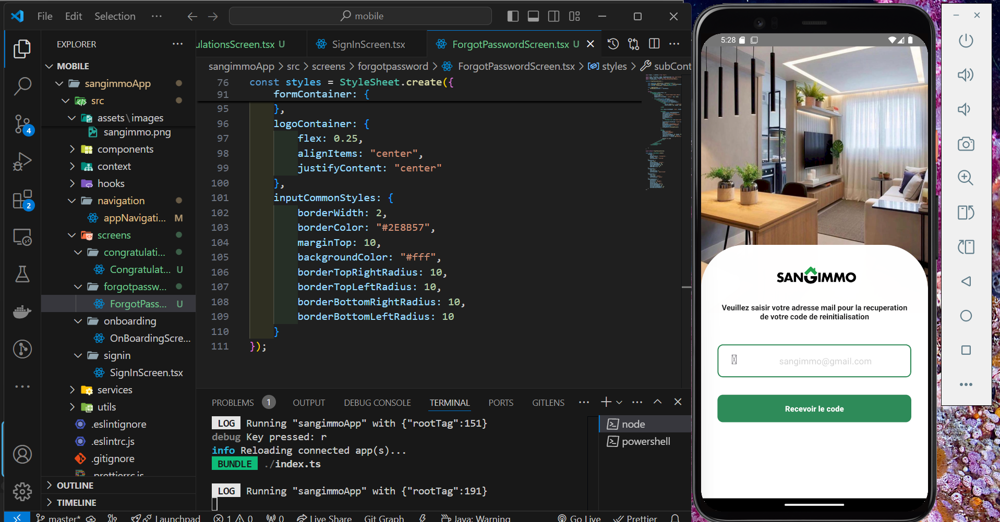
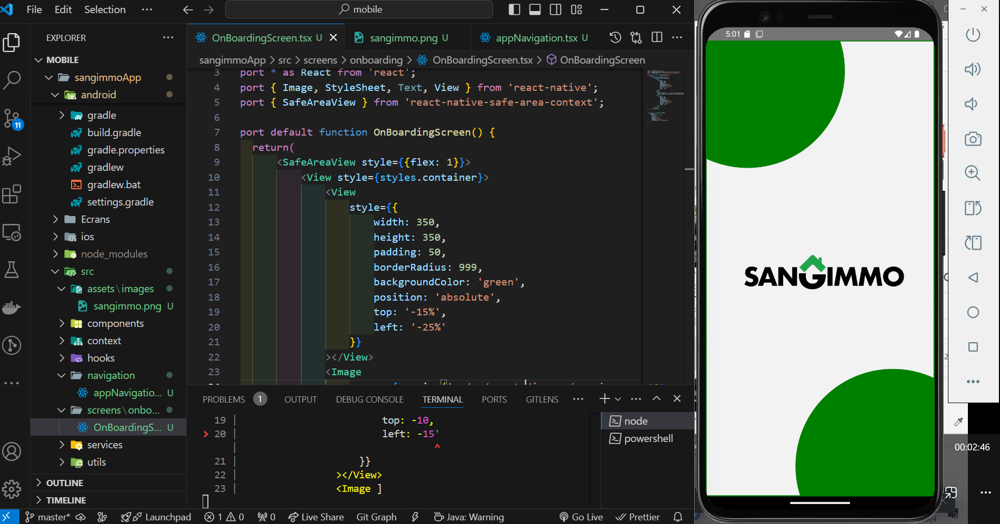
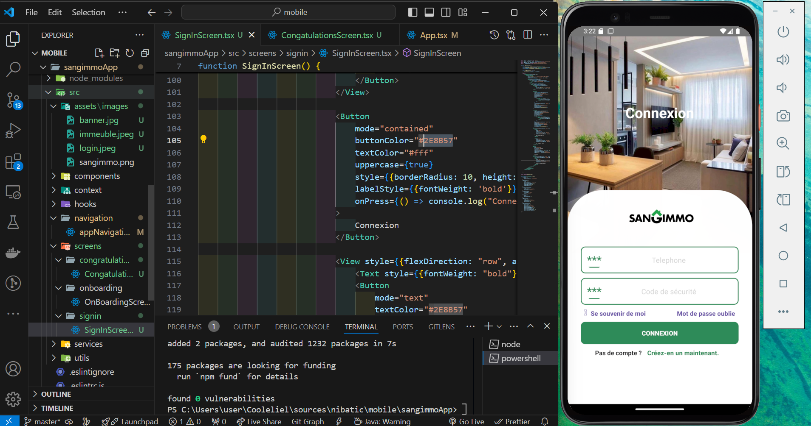
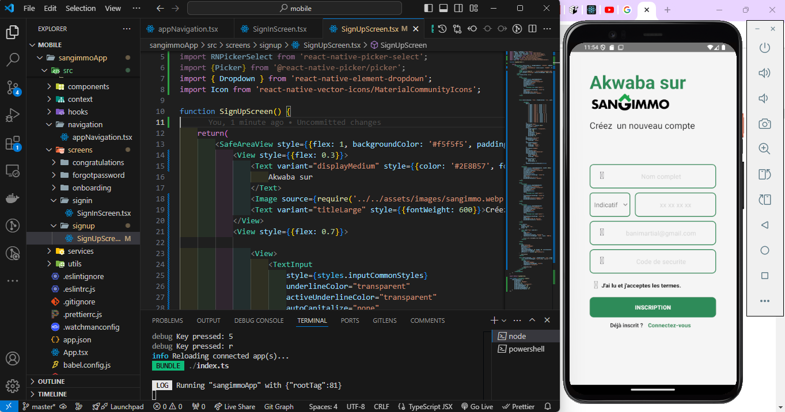
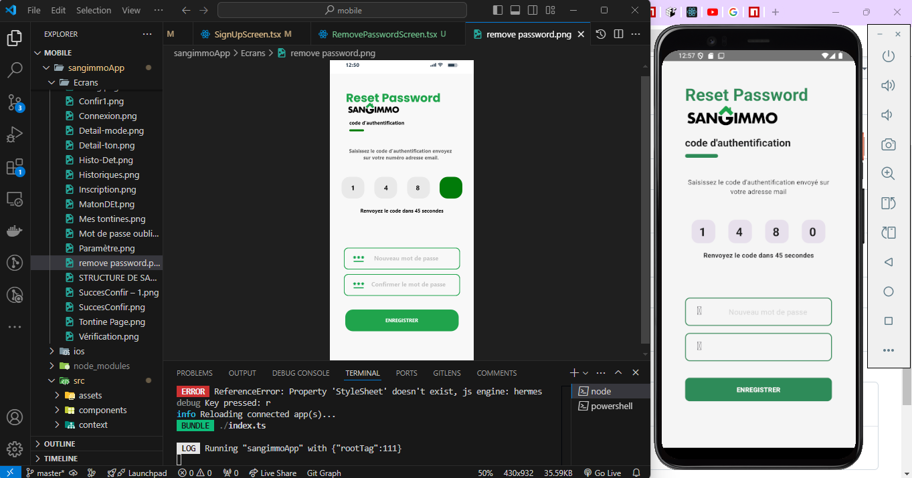
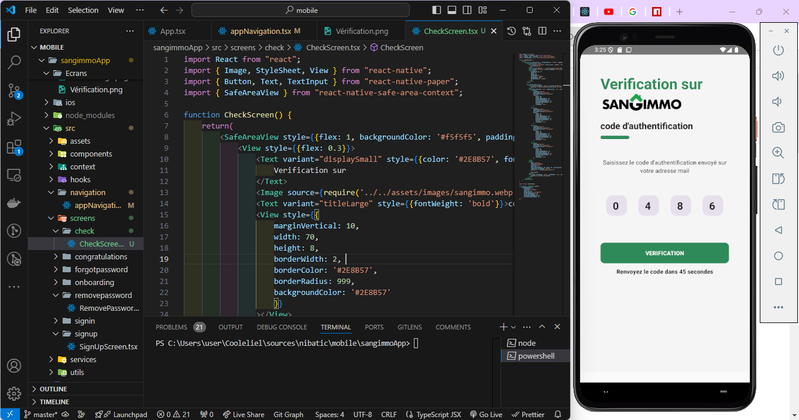
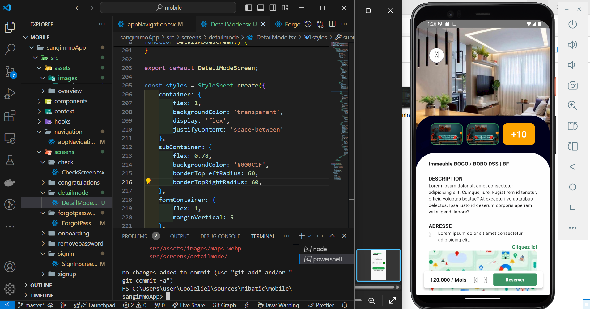
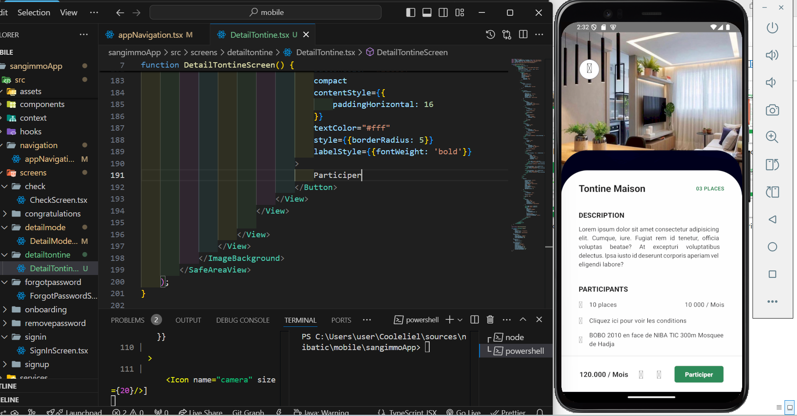
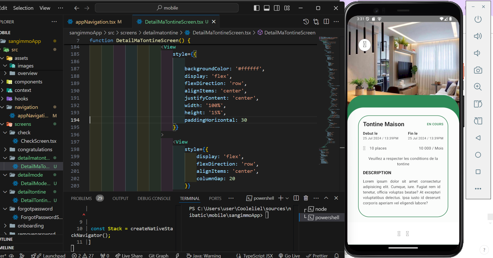

# Projet React Native SangImmo

Ce projet est une application React Native, initialisée avec @react-native-community/cli.

## Pour commencer

**Note :** Assurez-vous d'avoir suivi le guide de configuration de l'environnement React Native jusqu'à l'étape "Création d'une nouvelle application" avant de continuer.

### Étape 1 : Démarrer le serveur Metro

Pour lancer le bundler Metro, exécutez la commande suivante depuis la racine de votre projet :

```bash
# Avec npm
npm start

# OU avec Yarn
yarn start
```

### Étape 2 : Lancer votre application

Une fois Metro en cours d'exécution, ouvrez un nouveau terminal et lancez la commande suivante pour démarrer l'application :

```bash
# Pour Android
npm run android
# OU avec Yarn
yarn android

# Pour iOS
npm run ios
# OU avec Yarn
yarn ios
```

Si tout est configuré correctement, l'application devrait apparaître sur votre émulateur Android ou simulateur iOS. Vous pouvez également la lancer directement depuis Android Studio ou Xcode.

## Structure du projet

Voici un aperçu de la structure des dossiers du projet :

```
/sangimmoApp
├── /android               # Code natif Android pour la configuration et les builds
├── /ios                   # Code natif iOS pour la configuration et les builds
├── /src                   # Code source de l'application
│   ├── /assets            # Fichiers statiques (images, polices)
│   ├── /components        # Composants UI réutilisables
│   ├── /screens           # Vues principales de l'application
│   ├── /navigation        # Configuration de la navigation (ex: React Navigation)
│   ├── /services          # Appels API et intégrations
│   ├── /context           # Gestion de l'état global (React Context ou Redux)
│   ├── /hooks             # Hooks React personnalisés (optionnel)
│   └── /utils             # Fonctions utilitaires et helpers
├── /node_modules          # Dépendances du projet
├── App.tsx                # Point d'entrée principal de l'application
├── package.json           # Métadonnées du projet et gestion des dépendances
├── .eslintrc.js           # Configuration ESLint
├── .prettierrc            # Configuration Prettier (si utilisé)
└── tsconfig.json          # Configuration TypeScript (si TypeScript est utilisé)
```

## Modifier votre application

1. Ouvrez `App.tsx` ou `src` dans votre éditeur de texte et effectuez vos modifications.
2. Pour Android : Appuyez deux fois sur <kbd>R</kbd> ou utilisez <kbd>Ctrl</kbd> + <kbd>M</kbd> (ou <kbd>Cmd</kbd> + <kbd>M</kbd> sur macOS) pour ouvrir le Menu Développeur, puis choisissez "Recharger".
3. Pour iOS : Appuyez sur <kbd>Cmd</kbd> + <kbd>R</kbd> pour recharger dans le Simulateur iOS.

## Aperçu des écrans

<p align="center">
  
</p>

<p align="center">
  
</p>

<p align="center">
  
</p>

<p align="center">
  
</p>

<p align="center">
  
</p>

<p align="center">
  
</p>

<p align="center">
  
</p>

<p align="center">
  
</p>

<p align="center">
  
</p>

<p align="center">
  
</p>

## Dépannage

Si vous rencontrez des problèmes, consultez le [Guide de dépannage React Native](https://reactnative.dev/docs/troubleshooting).

## Pour en savoir plus

- [Site web React Native](https://reactnative.dev/) - En savoir plus sur React Native.
- [Premiers pas](https://reactnative.dev/docs/environment-setup) - Configurez votre environnement React Native.
- [Apprendre les bases](https://reactnative.dev/docs/getting-started) - Une introduction guidée à React Native.
- [Blog React Native](https://reactnative.dev/blog) - Restez à jour avec les derniers articles.

## Contribuer

Les contributions sont les bienvenues ! N'hésitez pas à ouvrir une issue ou à soumettre une pull request.

## Licence